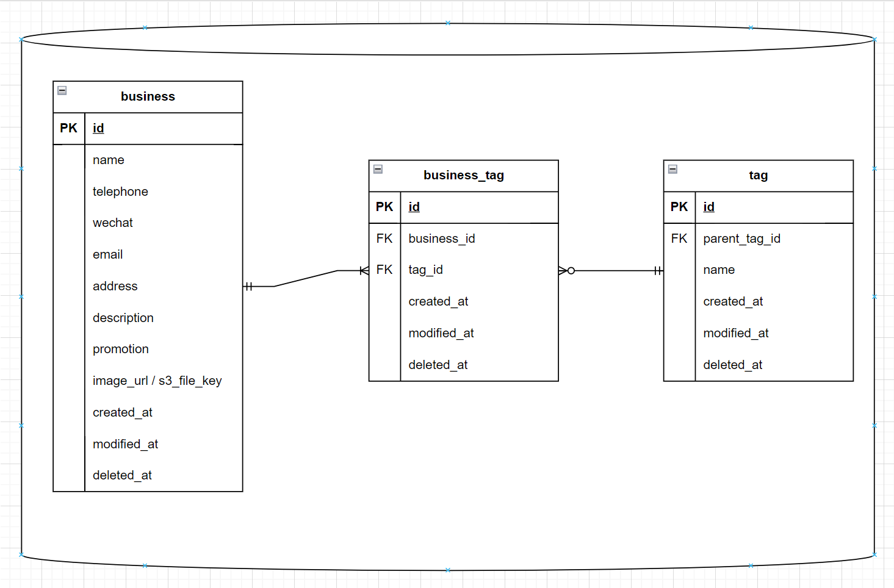

# 折扣卡

折扣卡是为了提供一个网站方便 cgsa 的伙伴们找到折扣卡对应的服务

## QuickStart

**目前只有 DB 拉的起来，前后端 dockerfile 还没写，各自对应的组麻烦自己完善一下**

1. `git clone https://github.com/USC-CGSA-Tech/discount-card.git`
2. 若是全部服务拉起来则是 `make launch-XXX` XXX 为 dev 或 prod
3. 指定服务则是 `make launch-XXX SERVICE=YYY` YYY 为 db, frontend, backend, admin
4. 各自项目内容直接在各自地方开发就行【记得建各自分支，main 会锁起来】

## 技术架构

### 数据库

直接用 mysql，体量小，简单就行

### 备注

- create 和 update 用同个接口，如果有 id 则视为 update，如果没 id 则视为 create
- 弹窗提醒暂定直接先写死 created_at 为近 7 天的数据
- search 搜索先用双边 like 去做匹配,【商家体量顶破天也才 1000】,如果要暴力的话可以每个信息都 like，但是感觉挺恶心的，最好还是指定模糊搜索什么东西（名字，描述，等等）
- 标签不需要筛选，没多少数据，前端直接按需请求，后端可以定时轮询数据库放到内存里，估计 redis 都用不上
- 前端请求 tag 然后自己根据树状结构渲染展示下拉归类
- 后期可以加上地图功能，根据当前距离筛选等等，估计需要调用 google maps api 或别的库
